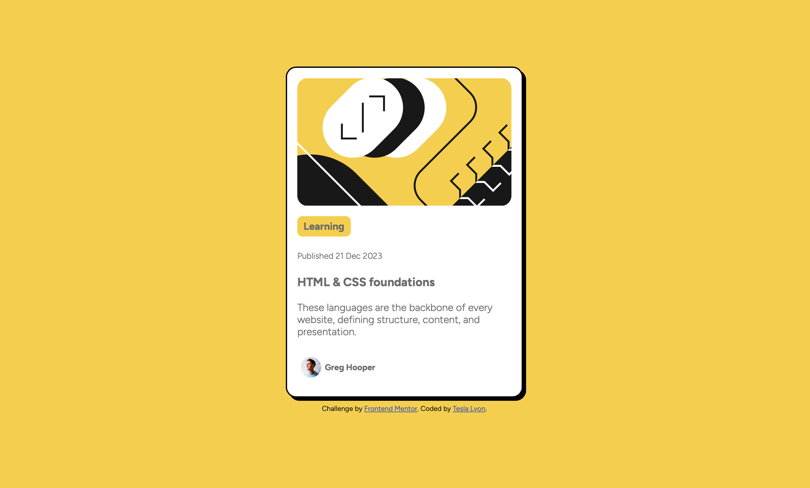

# Frontend Mentor - Blog preview card solution

This is a solution to the [Blog preview card challenge on Frontend Mentor](https://www.frontendmentor.io/challenges/blog-preview-card-ckPaj01IcS). Frontend Mentor challenges help you improve your coding skills by building realistic projects. 

## Table of contents

- [Overview](#overview)
  - [The challenge](#the-challenge)
  - [Screenshot](#screenshot)
  - [Links](#links)
- [My process](#my-process)
  - [Built with](#built-with)
  - [What I learned](#what-i-learned)
  - [Continued development](#continued-development)
  - [Useful resources](#useful-resources)
  - [AI Collaboration](#ai-collaboration)
- [Author](#author)
- [Acknowledgments](#acknowledgments)

**Note: Delete this note and update the table of contents based on what sections you keep.**

## Overview

### The challenge

Users should be able to:

- See hover and focus states for all interactive elements on the page

### Screenshot

### Links

- Solution URL: [https://https://github.com/Epicharmus/blog-preview-card](https://https://github.com/Epicharmus/blog-preview-card)
- Live Site URL: [https://epicharmus.github.io/blog-preview-card/](https://epicharmus.github.io/blog-preview-card/)

## My process

### Built with

- Semantic HTML5 markup
- CSS custom properties
- Flexbox
- Mobile-first workflow
- [Styled Components](https://styled-components.com/) - For styles

### What I learned

In this project, I practiced basic HTML components and CSS styling techniques. I am working to improve my understanding and speed at building elements using flex and flexbox and have noticed improvement in both through this project.

### Continued development

I want to continue focusing on my vanilla CSS development. I am very familiar with bootstrap but feel my basic CSS has deteriorated as I focused on the bootstrap framework.

## Author

- Website - [Tesla Lyon](https://www.teslalyon.com)
- Frontend Mentor - [@epicharmus](https://www.frontendmentor.io/profile/Epicharmus)
